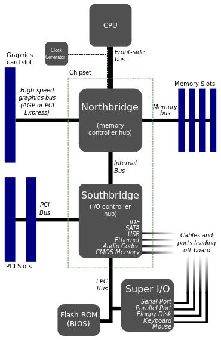

# xv6 sources with comments

## Overview
xv6のコード・リーディングを行い、プログラムにコメントとして記したもの。

---

## int instruction
int命令の挙動は明示的にコードに示されているわけではないため，補足として示しておく．  

### `Assume: "int n" instruction is invoked from user program`
1. read num n entry of IDT  
idtはgatedescのテーブル  
```c
// Gate descriptors for interrupts and traps
struct gatedesc {
  uint off_15_0 : 16;   // low 16 bits of offset in segment
  uint cs : 16;         // code segment selector
  uint args : 5;        // # args, 0 for interrupt/trap gates
  uint rsv1 : 3;        // reserved(should be zero I guess)
  uint type : 4;        // type(STS_{TG,IG32,TG32})
  uint s : 1;           // must be 0 (system)
  uint dpl : 2;         // descriptor(meaning new) privilege level
  uint p : 1;           // Present
  uint off_31_16 : 16;  // high bits of offset in segment
};
```

2. check CPL <= DPL  
CPLは%csの下位3bitに格納されており，それをgatedescのdplと比較する．  

3. save %esp and %ss in CPU-internal registers  
このステップはユーザモードからカーネルモードへの遷移が起こるときのみ実行される．  
(元々カーネルモードの場合は割り込み終了後もesp, ssを変更する必要はないため)  
%esp: ユーザスタックの位置  
%ss: 現在の実行特権レベルとどの領域が使用されているかを示す定数が格納されている  

4. load %ss and %esp from a task segment descriptor  
task segment descriptorはcpu構造体の中に格納されている．  
espには現在cpuが実行しているprocのkstackを指定している．  
setupuvmにおいてページテーブルをセットする際にcpuの中に格納される．  
ここからはユーザスタックではなく，カーネルスタックが利用される．  

5. Push %ss, %esp  
ステップ3が実行された場合のみ実行される．  
おそらくCPUの内部レジスタに格納されているユーザのss, espがPushされている．  

6. Push %eflags, %cs, %eip  
ユーザのeflags, cs, eipをカーネルスタックに積む．  
int命令がカーネルスタックに積むレジスタはこれらのみ．  
汎用レジスタ等の他のレジスタはvectorの冒頭でerror code, trapnoを積んだのちに，alltrapによって積まれる．  

7. clear the IF bit in %eflags only if an interrupt  
ステップ1で読みだしたgatedescにおけるtypeを参照し，interruptであった場合はIFを0にして割り込みを禁止する．  

8. set %cs, %eip to the value in the gate descriptor  
ステップ1で読みだしたgatedescにおけるcs, およびeip(off\_15\_0, off\_31\_16)をセットする．  
これで特権レベルがカーネルモードに切り替わり，対応するハンドラの実行に移る．  


### `Assume: "iret" instruction is invoked from interrupt handler`
vector(割り込みハンドラ)の中で汎用レジスタ等のレジスタは復元済み(trapret)であり，error code, trapnoはスタックポインタを8byteだけ上にあげることで破棄されている．  
この命令が呼び出された段階で，espはカーネルスタックのeipが積まれたところを指している．(int命令でスタックに積んだ部分)  

1. Pop %eip, %cs, %eflags  
int命令でカーネルスタックに積んだユーザのレジスタを復元する．  

2. Pop %esp, ss  
ユーザ空間に戻る必要があるときのみ実行される.  
スタックをユーザスタックに戻し，スタックに積んであったユーザのeip(int命令の次の命令の番地)から実行を再開する  

---

## Architecture
### `Modern Motherboard`

> [Motherboard-wiki](https://en.wikipedia.org/wiki/Motherboard "Motherboard")より引用(一部改変)  

#### `Northbridge`

#### `Southbridge`

---

## [Emulate xv6 in VM](./emu/ "Emulate xv6 in VM")
xv6をエミュレートする環境を構築する方法およびシェルスクリプトは[./emu/](./emu/ "./emu/")にまとめてある．  

---

## Copyright
The xv6 software is:

Copyright (c) 2006-2017 Frans Kaashoek, Robert Morris, Russ Cox,
                        Massachusetts Institute of Technology

Permission is hereby granted, free of charge, to any person obtaining
a copy of this software and associated documentation files (the
"Software"), to deal in the Software without restriction, including
without limitation the rights to use, copy, modify, merge, publish,
distribute, sublicense, and/or sell copies of the Software, and to
permit persons to whom the Software is furnished to do so, subject to
the following conditions:

The above copyright notice and this permission notice shall be
included in all copies or substantial portions of the Software.

THE SOFTWARE IS PROVIDED "AS IS", WITHOUT WARRANTY OF ANY KIND,
EXPRESS OR IMPLIED, INCLUDING BUT NOT LIMITED TO THE WARRANTIES OF
MERCHANTABILITY, FITNESS FOR A PARTICULAR PURPOSE AND
NONINFRINGEMENT. IN NO EVENT SHALL THE AUTHORS OR COPYRIGHT HOLDERS BE
LIABLE FOR ANY CLAIM, DAMAGES OR OTHER LIABILITY, WHETHER IN AN ACTION
OF CONTRACT, TORT OR OTHERWISE, ARISING FROM, OUT OF OR IN CONNECTION
WITH THE SOFTWARE OR THE USE OR OTHER DEALINGS IN THE SOFTWARE.

---

## Reference
[Text:book-rev10.pdf](https://pdos.csail.mit.edu/6.828/2017/xv6/book-rev10.pdf "book-rev10.pdf")  
[Code:xv6-rev10.pdf](https://pdos.csail.mit.edu/6.828/2017/xv6/xv6-rev10.pdf "xv6-rev10.pdf")  
[intel ia-32 manual](https://software.intel.com/en-us/articles/intel-sdm "intel ia-32 manual")  
[割り込みとIDTと](http://softwaretechnique.jp/OS_Development/kernel_development02.html "")
